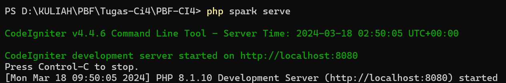

# CodeIgniter 4 

## Pengertian CodeIgniter
CodeIgniter adalah kerangka kerja (framework) pengembangan aplikasi web yang bersifat open-source, menggunakan bahasa pemrograman PHP. Dikembangkan oleh EllisLab, CodeIgniter dirancang untuk memudahkan pengembangan aplikasi web dengan menyediakan seperangkat alat dan aturan baku untuk mempercepat proses pengembangan.

## Instalasi CodeIgniter
Untuk menginstall CodeIgniter kita dapat menggunakan 2 cara yaitu dengan menggunakan composser atau dengan menggunakan cara manual.

jika kita menginstall CodeIgniter menggunakan Composser maka langkah langkahnya sebagai berikut :
1. Buka command prompt pada device anda.
2. Ketik code berikut : composer create-project codeigniter4/appstarter project-root (ganti project-root dengan nama file yang akan anda buat).
   
4. Klik enter lalu tunggu hingga instalasi CodeIgniternya selesai

## Menjalankan server pengembangan
Jika anda ingin menjalankan project anda maka anda harus menjalankan server pengembangannya. CodeIgniter menyediakan server bawaan php dengan menggunakan code yang sangat sederhana yaitu dengan menggunakan code berikut : php spark serve

Copy `env` to `.env` and tailor for your app, specifically the baseURL
and any database settings.

## Important Change with index.php

`index.php` is no longer in the root of the project! It has been moved inside the *public* folder,
for better security and separation of components.

This means that you should configure your web server to "point" to your project's *public* folder, and
not to the project root. A better practice would be to configure a virtual host to point there. A poor practice would be to point your web server to the project root and expect to enter *public/...*, as the rest of your logic and the
framework are exposed.

**Please** read the user guide for a better explanation of how CI4 works!

## Repository Management

We use GitHub issues, in our main repository, to track **BUGS** and to track approved **DEVELOPMENT** work packages.
We use our [forum](http://forum.codeigniter.com) to provide SUPPORT and to discuss
FEATURE REQUESTS.

This repository is a "distribution" one, built by our release preparation script.
Problems with it can be raised on our forum, or as issues in the main repository.

## Server Requirements

PHP version 7.4 or higher is required, with the following extensions installed:

- [intl](http://php.net/manual/en/intl.requirements.php)
- [mbstring](http://php.net/manual/en/mbstring.installation.php)

> [!WARNING]
> The end of life date for PHP 7.4 was November 28, 2022.
> The end of life date for PHP 8.0 was November 26, 2023.
> If you are still using PHP 7.4 or 8.0, you should upgrade immediately.
> The end of life date for PHP 8.1 will be November 25, 2024.

Additionally, make sure that the following extensions are enabled in your PHP:

- json (enabled by default - don't turn it off)
- [mysqlnd](http://php.net/manual/en/mysqlnd.install.php) if you plan to use MySQL
- [libcurl](http://php.net/manual/en/curl.requirements.php) if you plan to use the HTTP\CURLRequest library
