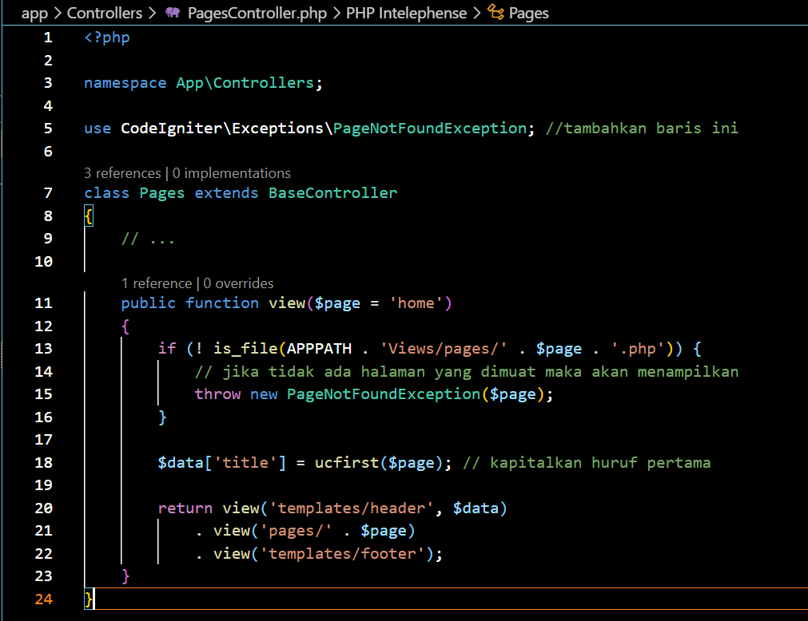

# CodeIgniter 4 

## 1. Pengertian CodeIgniter
CodeIgniter adalah kerangka kerja (framework) pengembangan aplikasi web yang bersifat open-source, menggunakan bahasa pemrograman PHP. Dikembangkan oleh EllisLab, CodeIgniter dirancang untuk memudahkan pengembangan aplikasi web dengan menyediakan seperangkat alat dan aturan baku untuk mempercepat proses pengembangan.

## 2. Instalasi CodeIgniter
Untuk menginstall CodeIgniter kita dapat menggunakan 2 cara yaitu dengan menggunakan composser atau dengan menggunakan cara manual.

jika kita menginstall CodeIgniter menggunakan Composser maka langkah langkahnya sebagai berikut :
1. Buka command prompt pada device anda.
2. Ketik code berikut : 
```
composer create-project codeigniter4/appstarter project-root
```
ganti project-root dengan nama file yang akan anda buat.
   
4. Klik enter lalu tunggu hingga instalasi CodeIgniternya selesai

## 3. Menjalankan server pengembangan
Jika anda ingin menjalankan project anda maka anda harus menjalankan server pengembangannya. CodeIgniter menyediakan server bawaan php dengan menggunakan code yang sangat sederhana yaitu dengan menggunakan code berikut :
```
 php spark serve
```

setelah itu nada pergi ke browser dan ketikan
```
http://localhost:8080 
```
maka akan muncul halaman selamat datang seperti dibawah ini.

ini berarti aplikasi anda berjalan dengan baik dan anda dapat melakukan perubahan.

## 4. Membuat halaman statis 
untuk membuat halaman statis maka anda harus melakukan perutean terlebih dahulu. Perutean ini menggunakan metode controller. Controller hanya sebuah class yang berfungsi untuk mendelegasikan pekerjaan yang anda buat, yaitu dengan cara sebagai berikut :
1. Pergi ke file rute yang terletak di app/Config/Routes.php . Maka akan mucul tampilan seperti dibawah ini.

2. Tambahkan code seperti dibawah ini.


3. Membuat pengontrol halaman
Kita dapat membuat pengontrol halaman dengan cara Buat file di app/Controllers/PagesController.php dengan kode berikut.
```
<?php

namespace App\Controllers;

class Pages extends BaseController
{
    public function index()
    {
        return view('welcome_message');
    }

    public function view($page = 'home')
    {
        // ...
    }
}
```

Anda telah membuat sebuah kelas yang bernama Pages, yang memiliki metode view() yang menerima satu parameter bernama $page. Kelas tersebut juga memiliki metode index() yang serupa dengan pengontrol default yang ditemukan di app/Controllers/Home.php. Metode ini bertujuan untuk menampilkan halaman selamat datang dari CodeIgniter.

4. Membuat tampilan
Setelah anda membuat metode pertama sekarang saatnya anda membaut beberapa template halaman dasar seperti headerdan footer untuk halaman anda.
Buat header di app/Views/templates/header.php dan tambahkan kode berikut:
```
<!doctype html>
<html>
<head>
    <title>Tutorial Menggunakan CodeIgniter</title>
</head>
<body>

    <h1><?= esc($title) ?></h1>
```
Sekarang, buat footer di app/Views/templates/footer.php yang menyertakan kode berikut:
```
    <em>&copy; 2022</em>
</body>
</html>
```
5. menambahkan logika ke controller
Sebelumnya anda telah membuat pengontrol dengan suatu metode view(). Metode ini menerima satu parameter yaitu  nama halaman yang akan dimuat. 
Body halaman yang akan dimuat terletak pada direktori app/Views .
Di direktori itu, buat dua file bernama home.php dan about.php . Di dalam file tersebut, ketikkan beberapa teks apa pun yang Anda suka dan simpan.


Untuk memuat halaman tersebut, Anda harus memeriksa apakah halaman yang diminta benar-benar ada. Ini akan menjadi isi metode view() pada PagesController yang dibuat di atas:
```
<?php

namespace App\Controllers;

use CodeIgniter\Exceptions\PageNotFoundException; // Add this line

class Pages extends BaseController
{
    // ...

    public function view($page = 'home')
    {
        if (! is_file(APPPATH . 'Views/pages/' . $page . '.php')) {
            // Whoops, we don't have a page for that!
            throw new PageNotFoundException($page);
        }

        $data['title'] = ucfirst($page); // Capitalize the first letter

        return view('templates/header', $data)
            . view('pages/' . $page)
            . view('templates/footer');
    }
}
```


6. Menjalankan aplikasi
