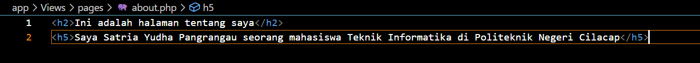

# CodeIgniter 4 

## 1. Pengertian CodeIgniter
CodeIgniter adalah kerangka kerja (framework) pengembangan aplikasi web yang bersifat open-source, menggunakan bahasa pemrograman PHP. Dikembangkan oleh EllisLab, CodeIgniter dirancang untuk memudahkan pengembangan aplikasi web dengan menyediakan seperangkat alat dan aturan baku untuk mempercepat proses pengembangan.

## 2. Instalasi CodeIgniter
Untuk menginstall CodeIgniter kita dapat menggunakan 2 cara yaitu dengan menggunakan composser atau dengan menggunakan cara manual.

jika kita menginstall CodeIgniter menggunakan Composser maka langkah langkahnya sebagai berikut :
1. Buka command prompt pada device anda.
2. Ketik code berikut : 
```
composer create-project codeigniter4/appstarter project-root
```
ganti project-root dengan nama file yang akan anda buat.
   
4. Klik enter lalu tunggu hingga instalasi CodeIgniternya selesai

## 3. Menjalankan server pengembangan
Jika anda ingin menjalankan project anda maka anda harus menjalankan server pengembangannya. CodeIgniter menyediakan server bawaan php dengan menggunakan code yang sangat sederhana yaitu dengan menggunakan code berikut :
```
 php spark serve
```

setelah itu nada pergi ke browser dan ketikan
```
http://localhost:8080 
```
maka akan muncul halaman selamat datang seperti dibawah ini.

ini berarti aplikasi anda berjalan dengan baik dan anda dapat melakukan perubahan.

## 4. Membuat halaman statis 
untuk membuat halaman statis maka anda harus melakukan perutean terlebih dahulu. Perutean ini menggunakan metode controller. Controller hanya sebuah class yang berfungsi untuk mendelegasikan pekerjaan yang anda buat, yaitu dengan cara sebagai berikut :
1. Pergi ke file rute yang terletak di app/Config/Routes.php . Maka akan mucul tampilan seperti dibawah ini.

2. Tambahkan code seperti dibawah ini.


3. Membuat pengontrol halaman
Kita dapat membuat pengontrol halaman dengan cara Buat file di app/Controllers/PagesController.php dengan kode berikut.
```
<?php

namespace App\Controllers;

class Pages extends BaseController
{
    public function index()
    {
        return view('welcome_message');
    }

    public function view($page = 'home')
    {
        // ...
    }
}
```

Anda telah membuat sebuah kelas yang bernama Pages, yang memiliki metode view() yang menerima satu parameter bernama $page. Kelas tersebut juga memiliki metode index() yang serupa dengan pengontrol default yang ditemukan di app/Controllers/Home.php. Metode ini bertujuan untuk menampilkan halaman selamat datang dari CodeIgniter.

4. Membuat tampilan
Setelah anda membuat metode pertama sekarang saatnya anda membaut beberapa template halaman dasar seperti headerdan footer untuk halaman anda.
Buat header di app/Views/templates/header.php dan tambahkan kode berikut:
```
<!doctype html>
<html>
<head>
    <title>Tutorial Menggunakan CodeIgniter</title>
</head>
<body>

    <h1><?= esc($title) ?></h1>
```

Sekarang, buat footer di app/Views/templates/footer.php yang menyertakan kode berikut:
```
    <em>&copy; 2022</em>
</body>
</html>
```


5. menambahkan logika ke controller
Sebelumnya anda telah membuat pengontrol dengan suatu metode view(). Metode ini menerima satu parameter yaitu  nama halaman yang akan dimuat. 
Body halaman yang akan dimuat terletak pada direktori app/Views .
Di direktori itu, buat dua file bernama home.php dan about.php . Di dalam file tersebut, ketikkan beberapa teks apa pun yang Anda suka dan simpan.


Untuk memuat halaman tersebut, Anda harus memeriksa apakah halaman yang diminta benar-benar ada.Ini akan menjadi isi metode view() pada PagesController yang dibuat di atas:
```
<?php

namespace App\Controllers;

use CodeIgniter\Exceptions\PageNotFoundException; // Add this line

class Pages extends BaseController
{
    // ...

    public function view($page = 'home')
    {
        if (! is_file(APPPATH . 'Views/pages/' . $page . '.php')) {
            // Whoops, we don't have a page for that!
            throw new PageNotFoundException($page);
        }

        $data['title'] = ucfirst($page); // Capitalize the first letter

        return view('templates/header', $data)
            . view('pages/' . $page)
            . view('templates/footer');
    }
}
```


6. Menjalankan aplikasi
Sekarang kunjungi 
```
localhost:8080/home
```
Jika perutean anda dilakukan dengan benar maka anda akan melihat halaman seperti berikut:


## 5. Membuat database untuk digunakan
Dalam pengaplikasian CodeIgniter kita dapat menggunakan Database, untuk itu kita harus membuat database terlebih dahulu setelah itu kita konfigurasikan dengan Codeigniter untuk menggunakannya

setelah itu buat tabel lalu isikan tabel yang telah dibuat, berikut adalah code sqlnya :
a. Membuat table
```
CREATE TABLE news (
    id INT UNSIGNED NOT NULL AUTO_INCREMENT,
    title VARCHAR(128) NOT NULL,
    year VARCHAR(5) NOT NULL,
    slug VARCHAR(128) NOT NULL,
    body TEXT NOT NULL,
    PRIMARY KEY (id),
    UNIQUE slug (slug)
);
```

b. Mengisikan table
```
INSERT INTO news VALUES
(1,'Elvis sighted','2001','elvis-sighted','Elvis was sighted at the Podunk internet cafe. It looked like he was writing a CodeIgniter app.'),
(2,'Say it isn\'t so!','2002','say-it-isnt-so','Scientists conclude that some programmers have a sense of humor.'),
(3,'Caffeination, Yes!','2003','caffeination-yes','World\'s largest coffee shop open onsite nested coffee shop for staff only.');
```


Setelah database terbuat maka kita harus menghubungkan database tersebut dengan cara menkonfigurasikan file .env dengan benar seperti berikut ini :
```
database.default.hostname = localhost
database.default.database = berita
database.default.username = root
database.default.password = 
database.default.DBDriver = MySQLi
```


Membuat Model 
Daripada menuliskan query langsung pada controller lebih baik menuliskannya pada model. sehingga kita bisa menggunakannya lagi nanti. untuk membuat model kita dapat melakukannya seperti berikut ini :
1. Buka direktori app/Models dan buat file baru bernama NewsModel.php dan tambahkan kode berikut.
```
<?php

namespace App\Models;

use CodeIgniter\Model;

class NewsModel extends Model
{
    protected $table = 'news';
}
```

Setelah itu tambahkan kode berikut ke model Anda.
```
 public function getNews($slug = false)
    {
        if ($slug === false) {
            return $this->findAll();
        }

        return $this->where(['slug' => $slug])->first();
    }
```


Menampilkan berita 
Setelah query ditulis, model harus dikaitkan dengan tampilan yang akan menampilkan item berita kepada pengguna. Ini bisa dilakukan di PagesController yang anda buat sebelumnya.
Ubah dulu perutean yang anda buat dengan cara ubah file app/Config/Routes.php Anda , sehingga terlihat seperti berikut:
```
<?php

// ...

use App\Controllers\News; // Add this line
use App\Controllers\Pages;

$routes->get('news', [News::class, 'index']);           // Add this line
$routes->get('news/(:segment)', [News::class, 'show']); // Add this line

$routes->get('pages', [Pages::class, 'index']);
$routes->get('(:segment)', [Pages::class, 'view']);
```


Setelah itu buat pengontrol baru di app/Controllers/News.php .
```
<?php

namespace App\Controllers;

use App\Models\NewsModel;

class News extends BaseController
{
    public function index()
    {
        $model = model(NewsModel::class);

        $data['news'] = $model->getNews();
    }

    public function show($slug = null)
    {
        $model = model(NewsModel::class);

        $data['news'] = $model->getNews($slug);
    }
}
```


Sekarang data diambil oleh pengontrol melalui model yang anda buat, tetapi belum ada yang ditampilkan. Hal berikutnya yang harus dilakukan adalah meneruskan data ini ke tampilan. Ubah index()metodenya menjadi seperti ini:
```
<?php

namespace App\Controllers;

use App\Models\NewsModel;

class News extends BaseController
{
    public function index()
    {
        $model = model(NewsModel::class);

        $data = [
            'news'  => $model->getNews(),
            'title' => 'News archive',
        ];

        return view('templates/header', $data)
            . view('news/index')
            . view('templates/footer');
    }

    // ...
}
```


Buat file tampilan news/index
Buat app/Views/news/index.php dan tambahkan potongan kode berikutnya.
```
<h2><?= esc($title) ?></h2>

<?php if (! empty($news) && is_array($news)): ?>

    <?php foreach ($news as $news_item): ?>

        <h3><?= esc($news_item['title']) ?></h3>

        <div class="main">
            <?= esc($news_item['body']) ?>
        </div>
        <p><a href="/news/<?= esc($news_item['slug'], 'url') ?>">View article</a></p>

    <?php endforeach ?>

<?php else: ?>

    <h3>No News</h3>

    <p>Unable to find any news for you.</p>

<?php endif ?>
```


Halaman ringkasan berita telah selesai, tetapi halaman untuk menampilkan setiap berita secara individual belum tersedia. Model yang sudah dibuat sebelumnya dapat dengan mudah digunakan untuk fungsi ini. Cukup tambahkan beberapa kode ke dalam controller dan buat tampilan baru. Kembali ke kontroler Berita dan perbarui metode show() dengan yang berikut ini:
```
<?php

namespace App\Controllers;

use App\Models\NewsModel;
use CodeIgniter\Exceptions\PageNotFoundException;

class News extends BaseController
{
    // ...

    public function show($slug = null)
    {
        $model = model(NewsModel::class);

        $data['news'] = $model->getNews($slug);

        if (empty($data['news'])) {
            throw new PageNotFoundException('Cannot find the news item: ' . $slug);
        }

        $data['title'] = $data['news']['title'];

        return view('templates/header', $data)
            . view('news/view')
            . view('templates/footer');
    }
}
```


Buat  news/view 
Satu-satunya hal yang perlu dilakukan adalah membuat tampilan terkait di app/Views/news/view.php . Letakkan kode berikut di file ini.
```
<h2><?= esc($news['title']) ?></h2>
<p><?= esc($news['body']) ?></p>
```
