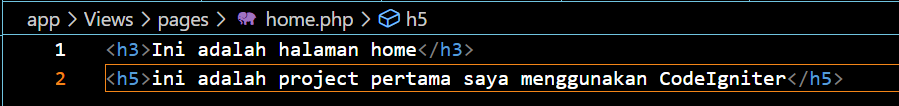
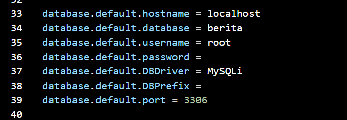
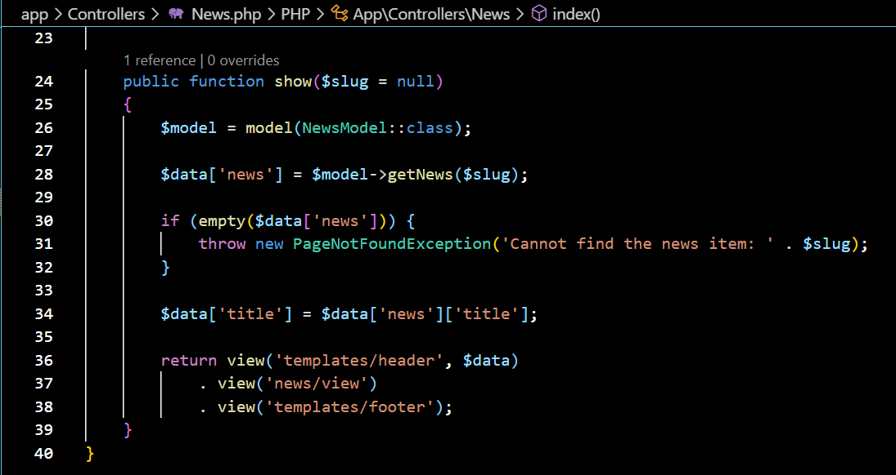
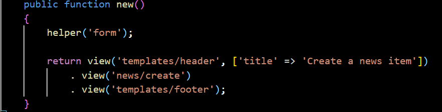
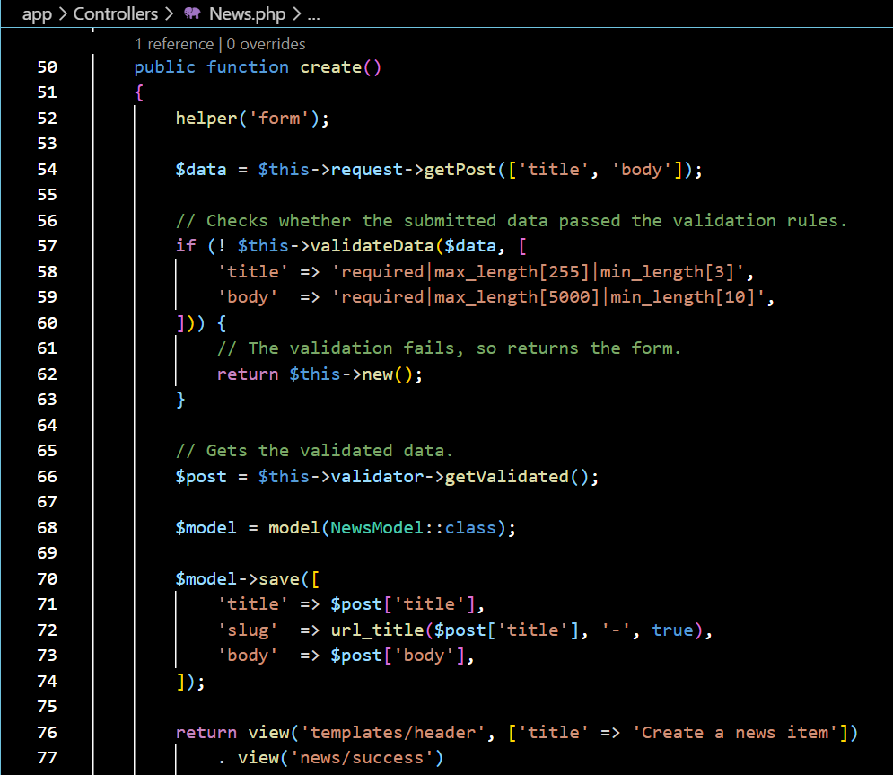
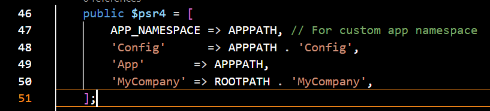

# CodeIgniter 4 

## 1. Pengertian CodeIgniter
CodeIgniter adalah kerangka kerja (framework) pengembangan aplikasi web yang bersifat open-source, menggunakan bahasa pemrograman PHP. Dikembangkan oleh EllisLab, CodeIgniter dirancang untuk memudahkan pengembangan aplikasi web dengan menyediakan seperangkat alat dan aturan baku untuk mempercepat proses pengembangan.

## 2. Persyaratan Server
1. PHP dan Ekstensi yang Diperlukan
Diperlukan PHP versi 7.4 atau lebih baru, dengan ekstensi PHP berikut diaktifkan:
- internasional
- mbstring
- json

2. Basis Data yang Didukung
Basis data diperlukan untuk sebagian besar pemrograman aplikasi web. Basis data yang didukung saat ini adalah:
- MySQL melalui MySQLidriver (hanya versi 5.1 ke atas)
- PostgreSQL melalui Postgredriver (hanya versi 7.4 dan lebih tinggi)
- SQLite3 melalui SQLite3driver
- Microsoft SQL Server melalui SQLSRVdriver (hanya versi 2005 dan lebih tinggi)
- Oracle Database melalui OCI8driver (hanya versi 12.1 dan lebih tinggi)


## 3. Model, View, dan Controller
MVC adalah singkatan dari Model, View, Controller. Ini adalah pola yang digunakan dalam pengembangan aplikasi web untuk mengatur kode agar mudah dikelola, menemukan file yang tepat, dan memudahkan pemeliharaan. Dalam MVC, aplikasi dipisahkan menjadi tiga komponen utama:
1. Model: Bertanggung jawab untuk mengelola data aplikasi dan menerapkan aturan bisnis khusus yang dibutuhkan oleh aplikasi.
2. View: Berupa file yang sederhana, dengan sedikit atau tanpa logika, yang digunakan untuk menampilkan informasi kepada pengguna.
3. Controller: Bertindak sebagai penghubung antara model dan view, menyusun data bolak-balik antara tampilan (atau pengguna yang melihatnya) dan penyimpanan data.
Penting untuk dicatat bahwa ada berbagai pandangan tentang peran masing-masing elemen dalam MVC, dan dokumentasi ini menawarkan pandangan tertentu tentang hal tersebut. Namun, pendekatan penggunaan setiap bagian dapat disesuaikan sesuai dengan kebutuhan proyek.

## 4. Instalasi CodeIgniter
Untuk menginstall CodeIgniter kita dapat menggunakan 2 cara yaitu dengan menggunakan composser atau dengan menggunakan cara manual.

jika kita menginstall CodeIgniter menggunakan Composser maka langkah langkahnya sebagai berikut :
1. Buka command prompt pada device anda.
2. Ketik code berikut : 
```
composer create-project codeigniter4/appstarter project-root
```
ganti project-root dengan nama file yang akan anda buat.
   
4. Klik enter lalu tunggu hingga instalasi CodeIgniternya selesai

## 5. Menjalankan server pengembangan
Jika anda ingin menjalankan project anda maka anda harus menjalankan server pengembangannya. CodeIgniter menyediakan server bawaan php dengan menggunakan code yang sangat sederhana yaitu dengan menggunakan code berikut :
```
 php spark serve
```

setelah itu nada pergi ke browser dan ketikan
```
http://localhost:8080 
```
maka akan muncul halaman selamat datang seperti dibawah ini.

ini berarti aplikasi anda berjalan dengan baik dan anda dapat melakukan perubahan.

## 6. Membuat halaman statis 
untuk membuat halaman statis maka anda harus melakukan perutean terlebih dahulu. Perutean ini menggunakan metode controller. Controller hanya sebuah class yang berfungsi untuk mendelegasikan pekerjaan yang anda buat, yaitu dengan cara sebagai berikut :
1. Pergi ke file rute yang terletak di app/Config/Routes.php . Maka akan mucul tampilan seperti dibawah ini.

2. Tambahkan code seperti dibawah ini.


3. Membuat pengontrol halaman
Kita dapat membuat pengontrol halaman dengan cara Buat file di app/Controllers/PagesController.php dengan kode berikut.
```
<?php

namespace App\Controllers;

class Pages extends BaseController
{
    public function index()
    {
        return view('welcome_message');
    }

    public function view($page = 'home')
    {
        // ...
    }
}
```

Anda telah membuat sebuah kelas yang bernama Pages, yang memiliki metode view() yang menerima satu parameter bernama $page. Kelas tersebut juga memiliki metode index() yang serupa dengan pengontrol default yang ditemukan di app/Controllers/Home.php. Metode ini bertujuan untuk menampilkan halaman selamat datang dari CodeIgniter.

4. Membuat tampilan
Setelah anda membuat metode pertama sekarang saatnya anda membaut beberapa template halaman dasar seperti headerdan footer untuk halaman anda.
Buat header di app/Views/templates/header.php dan tambahkan kode berikut:
```
<!doctype html>
<html>
<head>
    <title>Tutorial Menggunakan CodeIgniter</title>
</head>
<body>

    <h1><?= esc($title) ?></h1>
```

Sekarang, buat footer di app/Views/templates/footer.php yang menyertakan kode berikut:
```
    <em>&copy; 2022</em>
</body>
</html>
```


5. menambahkan logika ke controller
Sebelumnya anda telah membuat pengontrol dengan suatu metode view(). Metode ini menerima satu parameter yaitu  nama halaman yang akan dimuat. 
Body halaman yang akan dimuat terletak pada direktori app/Views .
Di direktori itu, buat dua file bernama home.php dan about.php . Di dalam file tersebut, ketikkan beberapa teks apa pun yang Anda suka dan simpan.


Untuk memuat halaman tersebut, Anda harus memeriksa apakah halaman yang diminta benar-benar ada.Ini akan menjadi isi metode view() pada PagesController yang dibuat di atas:
```
<?php

namespace App\Controllers;

use CodeIgniter\Exceptions\PageNotFoundException; // Add this line

class Pages extends BaseController
{
    // ...

    public function view($page = 'home')
    {
        if (! is_file(APPPATH . 'Views/pages/' . $page . '.php')) {
            // Whoops, we don't have a page for that!
            throw new PageNotFoundException($page);
        }

        $data['title'] = ucfirst($page); // Capitalize the first letter

        return view('templates/header', $data)
            . view('pages/' . $page)
            . view('templates/footer');
    }
}
```


6. Menjalankan aplikasi
Sekarang kunjungi 
```
localhost:8080/home
```
Jika perutean anda dilakukan dengan benar maka anda akan melihat halaman seperti berikut:


## 7. Membuat database untuk digunakan
1. Dalam pengaplikasian CodeIgniter kita dapat menggunakan Database, untuk itu kita harus membuat database terlebih dahulu setelah itu kita konfigurasikan dengan Codeigniter untuk menggunakannya

setelah itu buat tabel lalu isikan tabel yang telah dibuat, berikut adalah code sqlnya :
a. Membuat table
```
CREATE TABLE news (
    id INT UNSIGNED NOT NULL AUTO_INCREMENT,
    title VARCHAR(128) NOT NULL,
    year VARCHAR(5) NOT NULL,
    slug VARCHAR(128) NOT NULL,
    body TEXT NOT NULL,
    PRIMARY KEY (id),
    UNIQUE slug (slug)
);
```

b. Mengisikan table
```
INSERT INTO news VALUES
(1,'Elvis sighted','2001','elvis-sighted','Elvis was sighted at the Podunk internet cafe. It looked like he was writing a CodeIgniter app.'),
(2,'Say it isn\'t so!','2002','say-it-isnt-so','Scientists conclude that some programmers have a sense of humor.'),
(3,'Caffeination, Yes!','2003','caffeination-yes','World\'s largest coffee shop open onsite nested coffee shop for staff only.');
```


2. Setelah database terbuat maka kita harus menghubungkan database tersebut dengan cara menkonfigurasikan file .env dengan benar seperti berikut ini :
```
database.default.hostname = localhost
database.default.database = berita
database.default.username = root
database.default.password = 
database.default.DBDriver = MySQLi
```


3. Membuat Model 
Daripada menuliskan query langsung pada controller lebih baik menuliskannya pada model. sehingga kita bisa menggunakannya lagi nanti. untuk membuat model kita dapat melakukannya seperti berikut ini :
1. Buka direktori app/Models dan buat file baru bernama NewsModel.php dan tambahkan kode berikut.
```
<?php

namespace App\Models;

use CodeIgniter\Model;

class NewsModel extends Model
{
    protected $table = 'news';
}
```

Setelah itu tambahkan kode berikut ke model Anda.
```
 public function getNews($slug = false)
    {
        if ($slug === false) {
            return $this->findAll();
        }

        return $this->where(['slug' => $slug])->first();
    }
```


## 8. Menampilkan berita 
1. Setelah query ditulis, model harus dikaitkan dengan tampilan yang akan menampilkan item berita kepada pengguna. Ini bisa dilakukan di PagesController yang anda buat sebelumnya.
Ubah dulu perutean yang anda buat dengan cara ubah file app/Config/Routes.php Anda , sehingga terlihat seperti berikut:
```
<?php

// ...

use App\Controllers\News; // Add this line
use App\Controllers\Pages;

$routes->get('news', [News::class, 'index']);           // Add this line
$routes->get('news/(:segment)', [News::class, 'show']); // Add this line

$routes->get('pages', [Pages::class, 'index']);
$routes->get('(:segment)', [Pages::class, 'view']);
```


2. Setelah itu buat pengontrol baru di app/Controllers/News.php .
```
<?php

namespace App\Controllers;

use App\Models\NewsModel;

class News extends BaseController
{
    public function index()
    {
        $model = model(NewsModel::class);

        $data['news'] = $model->getNews();
    }

    public function show($slug = null)
    {
        $model = model(NewsModel::class);

        $data['news'] = $model->getNews($slug);
    }
}
```


3. Sekarang data diambil oleh pengontrol melalui model yang anda buat, tetapi belum ada yang ditampilkan. Hal berikutnya yang harus dilakukan adalah meneruskan data ini ke tampilan. Ubah index()metodenya menjadi seperti ini:
```
<?php

namespace App\Controllers;

use App\Models\NewsModel;

class News extends BaseController
{
    public function index()
    {
        $model = model(NewsModel::class);

        $data = [
            'news'  => $model->getNews(),
            'title' => 'News archive',
        ];

        return view('templates/header', $data)
            . view('news/index')
            . view('templates/footer');
    }

    // ...
}
```


4. Buat file tampilan news/index
Buat app/Views/news/index.php dan tambahkan potongan kode berikutnya.
```
<h2><?= esc($title) ?></h2>

<?php if (! empty($news) && is_array($news)): ?>

    <?php foreach ($news as $news_item): ?>

        <h3><?= esc($news_item['title']) ?></h3>

        <div class="main">
            <?= esc($news_item['body']) ?>
        </div>
        <p><a href="/news/<?= esc($news_item['slug'], 'url') ?>">View article</a></p>

    <?php endforeach ?>

<?php else: ?>

    <h3>No News</h3>

    <p>Unable to find any news for you.</p>

<?php endif ?>
```


5. Halaman ringkasan berita telah selesai, tetapi halaman untuk menampilkan setiap berita secara individual belum tersedia. Model yang sudah dibuat sebelumnya dapat dengan mudah digunakan untuk fungsi ini. Cukup tambahkan beberapa kode ke dalam controller dan buat tampilan baru. Kembali ke kontroler Berita dan perbarui metode show() dengan yang berikut ini:
```
<?php

namespace App\Controllers;

use App\Models\NewsModel;
use CodeIgniter\Exceptions\PageNotFoundException;

class News extends BaseController
{
    // ...

    public function show($slug = null)
    {
        $model = model(NewsModel::class);

        $data['news'] = $model->getNews($slug);

        if (empty($data['news'])) {
            throw new PageNotFoundException('Cannot find the news item: ' . $slug);
        }

        $data['title'] = $data['news']['title'];

        return view('templates/header', $data)
            . view('news/view')
            . view('templates/footer');
    }
}
```


6. Buat  news/view 
Satu-satunya hal yang perlu dilakukan adalah membuat tampilan terkait di app/Views/news/view.php . Letakkan kode berikut di file ini.
```
<h2><?= esc($news['title']) ?></h2>
<p><?= esc($news['body']) ?></p>
```

10. Kemudian arahkan browser Anda ke halaman “berita”, yaitu localhost:8080/news , Anda akan melihat daftar item berita, yang masing-masing memiliki link untuk menampilkan satu artikel saja.


## 9. Membuat item berita
Saat ini, Anda telah mempelajari cara membaca data dari database menggunakan CodeIgniter, tetapi Anda belum menambahkan data apa pun ke database. Pada tahap ini, Anda akan mengembangkan pengontrol dan model berita yang telah dibuat sebelumnya untuk menyertakan fungsionalitas ini.
1. mengaktifkan filter CSRF
Sebelum membuat formulir, aktifkan perlindungan CSRF.
Buka file app/Config/Filters.php dan perbarui $methodsproperti seperti berikut:
```
<?php

namespace Config;

use CodeIgniter\Config\BaseConfig;

class Filters extends BaseConfig
{
    // ...

    public $methods = [
        'post' => ['csrf'],
    ];

    // ...
}
```

Ini mengkonfigurasi filter CSRF untuk diaktifkan untuk semua permintaan POST .

2. Menambahkan Aturan Perutean
Sebelum Anda dapat mulai menambahkan item berita ke dalam aplikasi CodeIgniter Anda, Anda harus menambahkan aturan tambahan ke file app/Config/Routes.php . Pastikan file Anda berisi yang berikut ini:
```
<?php

// ...

use App\Controllers\News;
use App\Controllers\Pages;

$routes->get('news', [News::class, 'index']);
$routes->get('news/new', [News::class, 'new']); // Add this line
$routes->post('news', [News::class, 'create']); // Add this line
$routes->get('news/(:segment)', [News::class, 'show']);

$routes->get('pages', [Pages::class, 'index']);
$routes->get('(:segment)', [Pages::class, 'view']);
```


3. Buat formulir
Untuk menambahkan data ke database, Anda perlu membuat sebuah formulir di mana Anda dapat memasukkan informasi yang akan disimpan. Ini memerlukan formulir dengan dua bidang: satu untuk judul dan satu lagi untuk teks. Anda akan menerima bantuan dari judul kita di model.
Buatlah sebuah tampilan baru di direktori `app/Views/news/create.php`:
```
<h2><?= esc($title) ?></h2>

<?= session()->getFlashdata('error') ?>
<?= validation_list_errors() ?>

<form action="/news" method="post">
    <?= csrf_field() ?>

    <label for="title">Title</label>
    <input type="input" name="title" value="<?= set_value('title') ?>">
    <br>

    <label for="body">Text</label>
    <textarea name="body" cols="45" rows="4"><?= set_value('body') ?></textarea>
    <br>

    <input type="submit" name="submit" value="Create news item">
</form>
```


4. Pengontrol Berita
Kembali ke NewsController Anda.
Tambahkan News::new() untuk Menampilkan Formulir
Pertama, buatlah metode untuk menampilkan form HTML yang telah Anda buat.
```
<?php

namespace App\Controllers;

use App\Models\NewsModel;
use CodeIgniter\Exceptions\PageNotFoundException;

class News extends BaseController
{
    // ...

    public function new()
    {
        helper('form');

        return view('templates/header', ['title' => 'Create a news item'])
            . view('news/create')
            . view('templates/footer');
    }
}
```


5. Tambahkan News::create() untuk Membuat Item Berita
Selanjutnya, tambahkan metode `News::create()` untuk membuat item berita dari data yang dikirimkan.
Dalam metode ini, Anda akan melakukan tiga tindakan:
1. Memeriksa apakah data yang dikirimkan memenuhi aturan validasi.
2. Menyimpan item berita ke dalam database.
3. Mengembalikan halaman sukses.
```
<?php
namespace App\Controllers;
use App\Models\NewsModel;
use CodeIgniter\Exceptions\PageNotFoundException;

class News extends BaseController
{
    // ...
    public function create()
    {
        helper('form');

        $data = $this->request->getPost(['title', 'body']);

        // Checks whether the submitted data passed the validation rules.
        if (! $this->validateData($data, [
            'title' => 'required|max_length[255]|min_length[3]',
            'body'  => 'required|max_length[5000]|min_length[10]',
        ])) {
            // The validation fails, so returns the form.
            return $this->new();
        }

        // Gets the validated data.
        $post = $this->validator->getValidated();

        $model = model(NewsModel::class);

        $model->save([
            'title' => $post['title'],
            'slug'  => url_title($post['title'], '-', true),
            'body'  => $post['body'],
        ]);

        return view('templates/header', ['title' => 'Create a news item'])
            . view('news/success')
            . view('templates/footer');
    }
}
```
Kode di atas menambahkan banyak fungsi.


6. Membuat Halaman Sukses
Setelah ini, file tampilan dimuat dan dikembalikan untuk menampilkan pesan sukses. Buat tampilan di app/Views/news/success.php dan tulis pesan sukses seperti berikut ini :
```
<p>News item created successfully.</p>
```


7. Memperbarui Model Berita
Perbarui Model Berita Anda untuk memastikan bahwa data dapat disimpan dengan benar. Metode `save()` yang digunakan akan menentukan apakah informasi harus dimasukkan atau diperbarui, berdasarkan keberadaan kunci utama. Dalam kasus ini, karena tidak ada bidang id yang diteruskan, baris baru akan dimasukkan ke dalam tabelnya, yaitu news.
Namun, secara default, metode insert dan update pada Model tidak akan menyimpan data dengan benar karena tidak mengetahui bidang mana yang aman untuk diperbarui. Oleh karena itu, Anda perlu mengedit NewsModel untuk memberikan daftar bidang yang dapat diperbarui di properti `$allowedFields`.
```
<?php

namespace App\Models;
use CodeIgniter\Model;

class NewsModel extends Model
{
    protected $table = 'news';

    protected $allowedFields = ['title', 'slug', 'body'];
}
```


8. Buat Item Berita
Sekarang arahkan browser Anda ke tempat Anda menginstal CodeIgniter dan tambahkan /news/new ke URL. Tambahkan beberapa berita dan periksa halaman berbeda yang Anda buat.

setelah klik create maka akan muncul tampilan berikut ini 


## 10. Migrasi Database
Migrasi database merupakan cara yang terstruktur dan terorganisir untuk mengubah struktur database Anda. Anda bisa saja mengedit fragmen SQL secara manual, tetapi Anda kemudian perlu memberi tahu pengembang lain bahwa mereka harus menjalankannya juga. Selain itu, Anda harus melacak perubahan apa yang perlu dijalankan pada mesin produksi ketika Anda menerapkannya kembali.
Migrasi tabel database melacak migrasi mana yang telah dijalankan, jadi yang perlu Anda lakukan adalah memastikan bahwa migrasi Anda sudah dilakukan dan menjalankan perintah untuk membawa database ke kondisi terkini. Anda juga dapat menggunakan perintah untuk menjalankan migrasi dari semua namespace dengan 
``
spark migrate --all
``
1. Nama file migrasi
Setiap file migrasi dimulai dengan nomor migrasi diikuti oleh garis bawah dan deskripsi yang menjelaskan migrasi tersebut. Tahun, bulan, dan tanggal dapat dipisahkan dengan tanda hubung, garis bawah, atau tanpa pemisah sama sekali. Misalnya:
- 31-10-2012-100538_AlterBlogTrackViews.php
- 2012_10_31_100539_AlterBlogAddTranslations.php
- 20121031100537_AddBlog.php
Ini membantu dalam menghindari konflik penomoran saat bekerja dalam lingkungan tim.

2. Buat migrasi
Membuat migrasi pertama untuk situs baru yang memiliki blog. Semua migrasi akan disimpan dalam direktori `app/Database/Migrations/` dan memiliki nama seperti `2022-01-31-013057_AddBlog.php`.
```
<?php
namespace App\Database\Migrations;
use CodeIgniter\Database\Migration;
class AddBlog extends Migration
{
    public function up()
    {
        $this->forge->addField([
            'blog_id' => [
                'type'           => 'INT',
                'constraint'     => 5,
                'unsigned'       => true,
                'auto_increment' => true,
            ],
            'blog_title' => [
                'type'       => 'VARCHAR',
                'constraint' => '100',
            ],
            'blog_description' => [
                'type' => 'TEXT',
                'null' => true,
            ],
        ]);
        $this->forge->addKey('blog_id', true);
        $this->forge->createTable('blog');
    }

    public function down()
    {
        $this->forge->dropTable('blog');
    }
}
```


3. Grup Database
Migrasi hanya akan diterapkan pada satu grup database. Jika Anda memiliki beberapa grup yang didefinisikan di `app/Config/Database.php`, maka secara default migrasi akan dijalankan pada grup yang ditentukan dalam `$defaultGroup` dalam file konfigurasi tersebut.
Ada situasi di mana Anda mungkin memerlukan skema yang berbeda untuk grup database yang berbeda. Misalnya, Anda mungkin memiliki satu database untuk informasi umum situs dan database lain untuk data yang lebih penting.
Anda dapat memastikan bahwa migrasi hanya dijalankan pada grup database yang diinginkan dengan mengatur properti `$DBGroup` pada migrasi Anda. Nama ini harus identik dengan nama grup database yang diinginkan.
```
<?php
namespace App\Database\Migrations;
use CodeIgniter\Database\Migration;
class AddBlog extends Migration
{
    protected $DBGroup = 'alternate_db_group';

    public function up()
    {
        // ...
    }

    public function down()
    {
        // ...
    }
}
```


4. Ruang Nama
Pustaka migrasi dapat secara otomatis memindai semua ruang nama yang telah Anda tetapkan dalam `app/Config/Autoload.php` atau dimuat dari sumber eksternal seperti Composer. Hal ini dilakukan menggunakan properti `$psr4` untuk mencocokkan nama direktori. Sebagai hasilnya, semua migrasi yang ditemukan di `Database/Migrations` akan disertakan.
Setiap ruang nama memiliki versi migrasi yang independen. Hal ini memungkinkan Anda untuk meningkatkan atau menurunkan versi setiap modul (ruang nama) tanpa memengaruhi ruang nama lainnya.
Misalnya, anggap kita memiliki ruang nama berikut yang ditentukan dalam file konfigurasi Autoload:
```
<?php

$psr4 = [
    'App'       => APPPATH,
    'MyCompany' => ROOTPATH . 'MyCompany',
];
```


5. Perintah Command-Line
Untuk melakukan migrasi kita dapat menggunakan perintah command-line sebagai berikut:
```
php spark migrate
```
